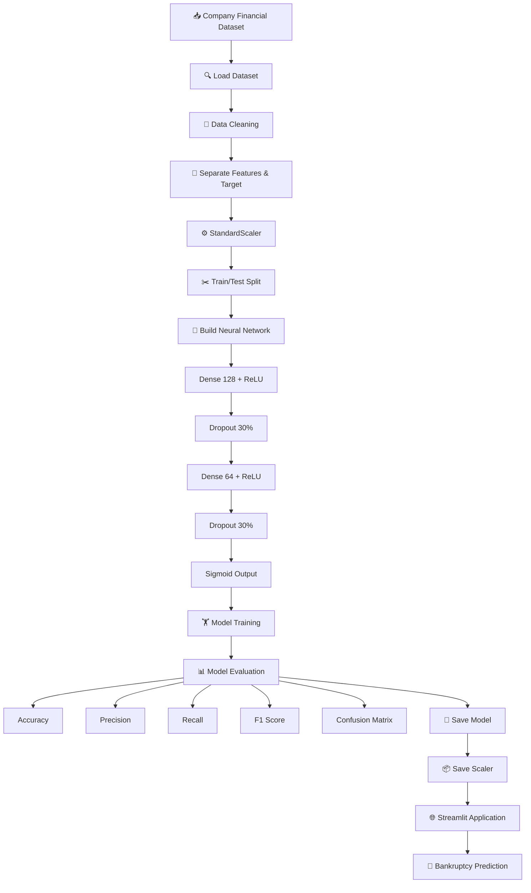

# 🏦 Company Bankruptcy Prediction using Deep Learning

<p align="center">

  
  
  
  

</p>

<p align="center">

  
  
  
  

</p>

---

## 📌 Overview

**Company Bankruptcy Prediction** is a Deep Learning-based binary classification project designed to predict whether a company is likely to become bankrupt based on its financial indicators.

The project uses a **TensorFlow/Keras Artificial Neural Network (ANN)** trained on company financial data. The input features are standardized using `StandardScaler`, and the trained model is integrated with a **Streamlit web application** for interactive prediction.

> 🎯 **Goal:** Transform financial indicators into a machine-learning prediction that can help analyze potential bankruptcy risk.

---

## 🚀 Key Features

* 🏦 Company bankruptcy classification
* 🧠 Deep Learning using TensorFlow/Keras
* 📊 Financial feature analysis
* ⚙️ Feature standardization using `StandardScaler`
* 🔀 Train/Test data splitting
* 🧬 Neural Network with Dense layers
* 🛡️ Dropout regularization
* 📈 Binary classification using Sigmoid activation
* 📏 Accuracy, Precision, Recall and F1-Score evaluation
* 🔲 Confusion Matrix generation
* 💾 Model persistence using `.keras`
* 📦 Scaler persistence using `joblib`
* 🌐 Interactive Streamlit application

---

## 🧠 Model Architecture

The implemented neural network follows this architecture:

```text
Input Features
      │
      ▼
┌─────────────────┐
│ Dense Layer     │
│ 128 Neurons     │
│ ReLU Activation │
└────────┬────────┘
         │
         ▼
┌─────────────────┐
│ Dropout         │
│ 30%             │
└────────┬────────┘
         │
         ▼
┌─────────────────┐
│ Dense Layer     │
│ 64 Neurons      │
│ ReLU Activation │
└────────┬────────┘
         │
         ▼
┌─────────────────┐
│ Dropout         │
│ 30%             │
└────────┬────────┘
         │
         ▼
┌─────────────────┐
│ Output Layer    │
│ 1 Neuron        │
│ Sigmoid         │
└────────┬────────┘
         │
         ▼
 Bankruptcy Prediction
```

### ⚙️ Configuration

| Component         | Configuration              |
| ----------------- | -------------------------- |
| Input Layer       | Number of dataset features |
| Hidden Layer 1    | 128 neurons                |
| Activation        | ReLU                       |
| Dropout           | 30%                        |
| Hidden Layer 2    | 64 neurons                 |
| Activation        | ReLU                       |
| Dropout           | 30%                        |
| Output Layer      | 1 neuron                   |
| Output Activation | Sigmoid                    |
| Optimizer         | Adam                       |
| Loss Function     | Binary Crossentropy        |
| Training Epochs   | 50                         |
| Batch Size        | 32                         |
| Validation Split  | 20%                        |

---

## 🔄 Project Workflow



---

## 📊 Dataset

The project uses the **Company Bankruptcy Prediction** dataset obtained through KaggleHub.

The dataset contains financial indicators used to determine the target variable:

```text
Bankrupt?
```

The notebook automatically downloads the dataset using:

```python
import kagglehub

path = kagglehub.dataset_download(
    "fedesoriano/company-bankruptcy-prediction"
)
```

### 🎯 Target

The target column used by the model is:

```text
Bankrupt?
```

The project separates the dataset into:

```python
X = df.drop('Bankrupt?', axis=1)
y = df['Bankrupt?']
```

---

## 🛠️ Technology Stack

<p align="center">


</p>

---

## 🔬 Data Preprocessing

Before training, the dataset goes through the following preprocessing pipeline:

### 1️⃣ Clean Column Names

```python
df.columns = df.columns.str.strip()
```

### 2️⃣ Separate Features and Target

```python
X = df.drop('Bankrupt?', axis=1)
y = df['Bankrupt?']
```

### 3️⃣ Feature Scaling

The financial features are standardized using `StandardScaler`.

```python
from sklearn.preprocessing import StandardScaler

scaler = StandardScaler()

X_scaled = scaler.fit_transform(X)
```

### 4️⃣ Train/Test Split

```python
from sklearn.model_selection import train_test_split

X_train, X_test, y_train, y_test = train_test_split(
    X_scaled,
    y,
    test_size=0.2,
    random_state=42
)
```

---

## 🧠 Deep Learning Model

The model is implemented using the Keras Sequential API.

```python
model = keras.Sequential([
    layers.Input(shape=(X_train.shape[1],)),
    layers.Dense(128, activation='relu'),
    layers.Dropout(0.3),
    layers.Dense(64, activation='relu'),
    layers.Dropout(0.3),
    layers.Dense(1, activation='sigmoid')
])
```

The model is compiled using:

```python
model.compile(
    optimizer='adam',
    loss='binary_crossentropy',
    metrics=['accuracy']
)
```

---

## 🏋️ Training

The network is trained using:

```python
history = model.fit(
    X_train,
    y_train,
    epochs=50,
    batch_size=32,
    validation_split=0.2
)
```

### Training Parameters

```text
Epochs          : 50
Batch Size      : 32
Validation      : 20%
Optimizer       : Adam
Loss            : Binary Crossentropy
```

---

## 📈 Model Evaluation

The trained model is evaluated on the test dataset.

The project calculates:

* 🎯 Accuracy
* 🔎 Precision
* 📡 Recall
* ⚖️ F1-Score
* 🔲 Confusion Matrix
* 📉 Test Loss

```python
loss, accuracy = model.evaluate(
    X_test,
    y_test,
    verbose=0
)
```

Additional classification metrics are calculated using Scikit-Learn.

```python
precision = precision_score(y_test, y_pred)
recall = recall_score(y_test, y_pred)
f1 = f1_score(y_test, y_pred)

conf_matrix = confusion_matrix(
    y_test,
    y_pred
)
```

> **Note:** The README intentionally does not claim specific metric values because the notebook source provided here contains the evaluation code but not the resulting metric output.

---

## 💾 Model Persistence

After training, both the neural network and preprocessing scaler are saved.

### 🧠 Model

```python
model.save('bankruptcy_model.keras')
```

### ⚙️ Scaler

```python
joblib.dump(
    scaler,
    'scaler.pkl'
)
```

This allows the same preprocessing and trained model to be reused during deployment.

---

## 🌐 Streamlit Application

The project includes a Streamlit-based interface for interactive predictions.

The application:

```text
User Input
    ↓
Financial Indicators
    ↓
StandardScaler
    ↓
Trained Neural Network
    ↓
Prediction Probability
    ↓
Bankruptcy Classification
```

The application loads the saved resources:

```python
model = tf.keras.models.load_model(
    'bankruptcy_model.keras'
)

scaler = joblib.load(
    'scaler.pkl'
)
```

---

## 📁 Project Structure

```text
Company-Bankruptcy-Prediction/
│
├── 📓 Company_Bankruptcy_Prediction.ipynb
│
├── 🧠 bankruptcy_model.keras
│
├── ⚙️ scaler.pkl
│
├── 🌐 app.py
│
├── 📄 README.md
│
└── 📋 requirements.txt
```

---

## ⚡ Installation

### 1. Clone the Repository

```bash
git clone https://github.com/your-username/company-bankruptcy-prediction.git
```

### 2. Navigate to the Project

```bash
cd company-bankruptcy-prediction
```

### 3. Install Dependencies

```bash
pip install -r requirements.txt
```

### 4. Run the Streamlit Application

```bash
streamlit run app.py
```

The application will be available through the local Streamlit server.

---

## 📦 Requirements

A suitable `requirements.txt` for the implementation includes:

```text
pandas
numpy
scikit-learn
tensorflow
keras
streamlit
joblib
kagglehub
```

---

## 🎯 Use Cases

This project demonstrates how Deep Learning can be applied to:

* 🏦 Financial risk analysis
* 📊 Corporate financial analysis
* 🔍 Bankruptcy classification
* 🤖 AI-assisted financial decision support
* 🌐 Machine Learning application deployment
* 📈 Predictive analytics

> ⚠️ **Disclaimer:** This project is an educational machine-learning implementation and should not be used as the sole basis for real-world financial or investment decisions.

---

## 🔮 Future Improvements

Potential improvements include:

* 📊 Advanced Exploratory Data Analysis
* ⚖️ Handling class imbalance
* 🧪 Hyperparameter optimization
* 🧠 Comparing ANN with traditional ML models
* 📈 ROC-AUC analysis
* 🔲 Improved confusion-matrix visualization
* 🧩 Explainable AI using SHAP
* 🚀 Cloud deployment
* 🔐 Input validation and security improvements
* 📱 Improved Streamlit UI/UX
* 📊 Real-time financial data integration

---

## 🧪 Machine Learning Pipeline

```text
Dataset
   ↓
Data Cleaning
   ↓
Feature / Target Separation
   ↓
Standardization
   ↓
Train-Test Split
   ↓
Neural Network
   ↓
Training
   ↓
Evaluation
   ↓
Model + Scaler Serialization
   ↓
Streamlit Deployment
   ↓
Prediction
```

---

## 👨‍💻 Author

**Aravind**

AI & Data Science Student | Deep Learning | Machine Learning | Data Analytics

---

## ⭐ Support

If you found this project useful:

⭐ **Star this repository**

🍴 **Fork the project**

🐛 **Open an issue**

💡 **Contribute improvements**

---

<p align="center">

### 🧠 Built with Deep Learning • 📊 Powered by Data • 🚀 Deployed with Streamlit

</p>
